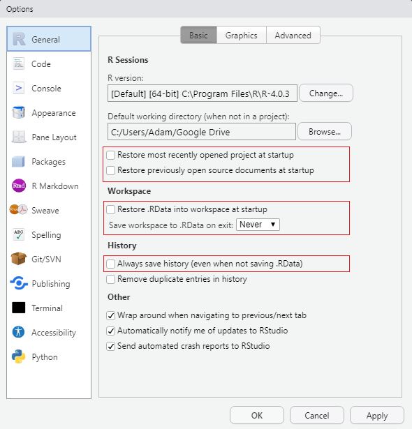
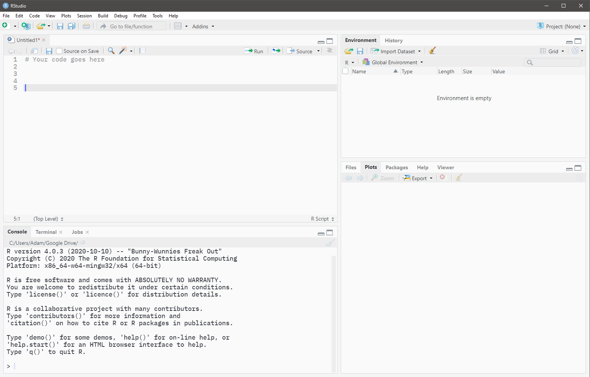

```{r, include=FALSE}
knitr::opts_chunk$set(
  echo=TRUE, message=FALSE, warning=FALSE, fig.align="center", fig.retina=3
)
```

# Lab 1 &mdash; September 15

## Review of R basics

**R** is the name of the programming language. **RStudio** is the name of the integrated development
environment (IDE). The application you should be running is **RStudio**.

If you do not already have these, **R** can be downloaded [here](https://utstat.toronto.edu/cran/). 
**RStudio** (desktop version) can be downloaded 
[here](https://www.rstudio.com/products/rstudio/#rstudio-desktop). **R** should be installed before
installing **RStudio**. 

If you already have **R** installed on your device, ensure that the version is >= 4.0.0. Otherwise,
use the links above to install the latest version.


### Configure RStudio settings

The settings can be found under `Tools -> Global Options...`.

```{r, echo=FALSE, out.width="100%"}

```

Uncheck all boxes and modify all dropdowns that mention saving items upon exit and restoring items
upon startup. This will ensure that RStudio starts with a fresh session each time.


### Console pane

When the RStudio application is opened, the **Console** pane should occupy the entirety of the left
side. *(Open the below image in a new tab if it is too small)*

```{r, echo=FALSE, out.width="100%"}
knitr::include_graphics("./img/rstudio-console.png")
```

Any code that is typed into the **Console** is evaluated immediately upon pressing <kbd>Enter</kbd>.
If you need to evaluate multi-line code, <kbd>Shift</kbd> + <kbd>Enter</kbd> should be used to
create line breaks.

The **Console** is often used to evaluate code that may not be part of your main analyses. This
includes checking your work, testing code, modifying settings, etc.


### Source pane

When the RStudio application is opened, the **Source** pane is hidden by default. The **Source**
pane is where you modify your R scripts and type the main code of your analyses. It is strongly 
recommended that you save all your important code (code that you may need to revisit at a later 
date) inside a R script file. A new R script can be created using:

-   `File -> New File -> R Script`, or
-   <kbd>Ctrl</kbd> + <kbd>Shift</kbd> + <kbd>N</kbd>, or
-   Clicking  and selecting "R Script"

The **Source** pane will appear in the top left when there is an open R script. 
*(Open the below image in a new tab if it is too small)*

```{r, echo=FALSE, out.width="100%"}

```

Code that is typed in a script file is not evaluated upon pressing <kbd>Enter</kbd>. Code must be
sent from the **Source** to the **Console** for evaluation.

-   To run a single line of code, place the typing cursor anywhere on the line and press
<kbd>Ctrl</kbd> + <kbd>Enter</kbd>.
-   To run multiple lines of code, highlight the desired lines and press <kbd>Ctrl</kbd> + 
<kbd>Enter</kbd>.
-   To run an entire script from start to finish, click  .


### Environment pane

The **Environment** pane is the top right pane of RStudio. This pane shows all variables that have
been initialised in your current R session. All variables in the current R session can be removed
by clicking the broom icon. Alternatively, switching from *Grid* view to *List* view will allow you
remove only selected variables.


### Comments

Comments can be added to an R script by prepending them with a `#` symbol.


### Variables

Variables are created using the convention `name <- value`.

```{r}
var1 <- 3
```

Once a variable has been successfully initialised, it should appear in the **Environment** pane. For
simple variables, the value of the variable can be seen in the **Environment** pane. For variables
whose values are not visible in the **Environment** pane, their values can be checked by calling
them in the **Console**:

```{r}
var1
```

or by using RStudio's built-in viewer by typing in the **Console**:

```{r, eval=FALSE}
View(var1)
```

When naming variables, try not to use names that already exist in R as data sets or functions. This
can be checked by partially typing the variable name and seeing what suggestions come up. For
example, when reading in data, do not name your variable `data` since there already exists
a `data()` function in R.


### Vectors

Vectors are univariate data structures. Vectors can be created using the `c()` function with 
elements separated by commas.

```{r}
nums <- c(9, 12, 20)
words <- c("apple", "orange", "banana")
```

Note that in the example

```{r, eval=FALSE}
var1 <- 3
```

`var1` is actually a vector of length 1.

When calling vectors in the **Console**, note that the numbers in the square brackets of the 
corresponding output represent the position number of the first element of the line.

```{r}
var2 <- 1:30

var2
```

#### Extracting elements

The elements of vectors can be extracted by supplying a vector of positive integers inside square 
brackets. **Note that in R, indices begin at 1.**

```{r}
var2[7]
var2[c(2, 7, 9, 11, 20)]
```

#### Deleting elements

The elements of vectors can be deleted by supplying a vector of negative integers or by placing a
negative outside a vector of positive integers, all inside square brackets. 
**Note that in R, indices begin at 1.**

```{r}
var2[-7]
var2[c(-2, -7, -9, -11, -20)]
var2[-c(2, 7, 9, 11, 20)]
```

### Data frames

Data frames are multivariate data structures. Data frames can be thought of as a vertical
concatentation of vectors. In most cases, each column of a data frame contains the values for a 
single variable and each row of a data frame contains the values of each variable for a single 
observation. For example, consider the following data set:

```{r}
patients <- data.frame(
  patient_id = c("123abc", "28fnr8", "02jr8d", "r82j45", "t90ro5"),
  height = c(181, 145, 190, 210, 94),
  mass = c(85, 72, 82, 90, 60),
  sex = c("M", "F", "M", "F", "F")
)

patients
```

In the example above, each column contains the values for a single variable and each row contains
the values of each variable for a single observation (patient). 

Things to note:

-   Data frames can be created by supplying name-value pairs to the `data.frame()` function.
-   Name-value pairs are supplied using `=` rather than `<-`.
-   Each name-value pair must have the same length. Missing values can be represented using `NA`.


#### Extracting columns

Columns of a data frame can be extracted as vectors using the dollar sign (`$`).

```{r}
patients$height
patients$sex
```


#### Extracting rows and subsets

Thinking of data frames as matrices, which can be subsetted by supplying row and column 
positions/names separated by a comma within square brackets:

```{r}
# Extract row 3 and all columns
patients[3, ]

# Extract rows 1, 4, and 5, and columns 1 and 3
patients[c(1, 4, 5), c(1, 3)]

# Extract rows 1, 4, and 5, and columns "patient_id" and "mass"
patients[c(1, 4, 5), c("patient_id", "mass")]

# Extract everything *except* rows 2 and 3, and columns 2 and 3
patients[-c(2, 3), -c(2, 3)]
```


### The working directory

The working directory is the folder path that you are working out of. The path of the current 
working directory can be found immediately underneath the **Console** tab heading.

When opening your first instance of RStudio using the application directly, the working directory is
automatically set to the 
["Default working directory (when not in a project)"](#configure-rstudio-settings). When the first
instance of RStudio is opened by opening a R script file (files ending in .R), the working directory
is automatically set to the folder where the R script file is located. 

Note that after opening your first instance of RStudio, any other scripts that are opened will not
change the working directory. 

The working directory is important to keep track of when reading and writing files. For the sake of
organization, it may be the case that you have the following folder structure:

```
.
├── data
│   └── my_data.txt
├── output
│   ├── output1.txt
│   └── model.RDS
├── script1.R
└── script2.R
```

*The dot represents where you currently are (the working directory).*

In the example above, the R scripts are contained in the working directory, while data and output
files have their own folders in the working directory. As such, when reading files we need to specify
that they are to be read from the "data" folder. Similarly, when writing files, we need to specify
that they are to be written into the "output" folder.

To be able to do this, we need to talk about file and folder paths and how to specify them.


### Paths

A path is a string (i.e. needs to be surrounded by quotes) and describes the location of a file or
folder on a device. Paths become extremely important when reading and writing files with R. Paths
can be broken down into two categories: absolute and relative.


#### Absolute paths

An absolute path gives the full location of a file/folder on **your** device, irrespective of your
current working directory, e.g.

```
"C:/Users/Adam/Desktop/blah.R"
"/Users/John/Documents/lab1.txt"
```

The use of absolute paths creates a few problems.

1. Suppose that I am on Windows and include a path like `"C:/Users/Adam/Desktop/blah.R"` in my
script. If you were to execute the code that I have given you on a Windows machine, it would likely
not work since your name is probably not Adam and your `blah.R` may not be located on your Desktop
like mine. 

2. For users who are not on Windows, in addition to the folders possibly not existing, you likely
do not have a "C drive".

As such, the use of absolute paths is **not** recommended as it complicates the sharing of code
between devices and is platform-dependent.


#### Relative paths

A relative path gives the partial location of a file/folder relative to your working directory.
Although the use of relative paths still assumes an identical partial folder structure, it
**does not** assume an identical folder structure down to the root of the path.

There are two helpers for specifying relative paths: the dot, `"."`, and the double-dot, `".."`. The
dot, `"."`, can be thought of as shorthand for *"here"*, or the current working directory. The
double-dot, `".."`, means to "go up one level".

**Example 1:**

Suppose that my working directory is `"C:/Users/Adam/Desktop"` with structure:

```
C:/Users/Adam/Desktop **you are here**
│
├── my_data.txt
└── script1.R
```

Inside `script1.R`, I want to read the data found in `my_data.txt`. This can be done using:

```{r, eval=FALSE}
my_data <- read.table("my_data.txt") 
## OR ##
my_data <- read.table("./my_data.txt")
```

rather than using:

```{r, eval=FALSE}
my_data <- read.table("C:/Users/Adam/Desktop/my_data.txt")
```

**Example 2:**

Suppose that my working directory is `"C:/Users/Adam/Desktop/model"` with **surrounding** folder
structure:

```
C:/Users/Adam/Desktop
│
├── data
│   └── my_data.txt
├── model **you are here**
│   ├── output1.txt
│   └── model.R
├── output
│   ├── output1.txt
│   └── output2.RDS
└── other.R
```

Inside `model.R`, I want to read the data found in `my_data.txt`. This can be done using:

```{r, eval=FALSE}
my_data <- read.table("../data/my_data.txt")
```

rather than using:

```{r, eval=FALSE}
my_data <- read.table("C:/Users/Adam/Desktop/data/my_data.txt")
```


### Reading in data

In this course, most (if not all) data will be read in from a `.txt` file that has a header. The
code you will use will be:

```{r, eval=FALSE}
my_data <- read.table("path/to/data/file.txt", header=TRUE)
```

In some instances, we may need:

```{r, eval=FALSE}
my_data <- read.table("path/to/data/file.txt", header=TRUE, stringsAsFactors=TRUE)
```


### Accessing the built-in documentation

Prepending a function or built-in data set with a question mark will bring up the associated
documentation. For example, in the **Console**, try:

```{r, eval=FALSE}
?read.table
?lm
?rock
```


## Introduction to simple linear regression

Note: the content contained in the following sections will aid you in answering Assignment 1
Question 5.


### Loading the data

The data set that we will be using can be found in the file named `table1.1_DS.txt`. Since this is
a text file with a header, we will use `read.table()` to read it in and specify `header=TRUE`.

My data is contained in a folder called "data" in my current working directory. The path you use
to read your data will depend on where you have saved your data.

```{r}
table1.1 <- read.table("./data/table1.1_DS.txt", header=TRUE)
```

We can get the dimensions of this data set using the functions `dim()`, `ncol()`, and `nrow()`.

```{r}
dim(table1.1)
nrow(table1.1)
ncol(table1.1)
```

We can get the column names of our data set using the `names()` function.

```{r}
names(table1.1)
```

We can preview the data we have read in using the `head()` function. The `head` function is useful
especially for larger data sets where printing the entire data set may not be desirable. By
default, this function will return the first six rows of the data.

```{r}
head(table1.1)
```

We can also use RStudio's built-in object viewer to view the full data set. In the **Environment**
pane:

-   In *List* view, click the row corresponding to the variable containing the data.
-   In *Grid* view, click the row corresponding to the variable containing the data under the
"Value" heading.

Alternatively, you can use the `View()` function:

```{r, eval=FALSE}
View(table1.1)
```


### Creating the data manually

In Assignment 1 Question 5, you are given the data as ordered pairs that you will need to manually
enter into R. Using the first ten observations from `table1.1` as an example, we can create the 
data frame manually:

```{r}
table1.1_manual <- data.frame(
  y = c(10.98, 11.13, 12.51, 8.40, 9.27, 8.73, 6.36, 8.50, 7.82, 9.14),
  x = c(35.3, 29.7, 30.8, 58.8, 61.4, 71.3, 74.4, 76.7, 70.7, 57.5)
)

head(table1.1_manual)
```

*(I will continue using the full Table 1.1 for the demonstrations below).*


### Fitting the SLR model

Linear regression models are fit using the `lm()` function. We first need to fit the model

\[Y_{i} \,=\, \beta_{0} \,+\, \beta_{1}X_{i} \,+\, \varepsilon_{i}, \quad i=1,\ldots,n\]

in order to determine whether 

\[Y_{i} \,=\, \beta_{0} \,+\, \varepsilon_{i}, \quad i=1,\ldots,n\]

is an appropriate model.

```{r}
slr_model <- lm(y ~ x, data=table1.1)
```

The above code says to build a linear regression model using `y` as the dependent (response)
variable, `x` as the independent (predictor) variable, and that the variables `y` and `x` are
found within the `table1.1` data variable. Although we do not need to specify an intercept in the
formula specification, linear regression models built with `lm()` include an intercept by default.


### Inspecting the model

We can obtain a summary of our linear regression model by using the `summary()` function.

```{r}
summary(slr_model)
```

From the information above, our fitted regression line has equation:

\[\widehat{y}_{i} \,=\, 13.62 \,-\, 0.08x_{i} \quad i=1,\ldots,n\]


### Is an intercept-only model appropriate?

To determine whether an intercept-only model would be appropriate, we need to test the hypotheses:

\[H_{0}: \beta_{1} \,=\, 0, \quad H_{A}: \beta_{1} \,\neq\, 0\]

The value of the test statistic can be read off the summary table and has a value of `-7.586` and
a corresponding $p$-value of `1.05e-07`. Using a significance level of $\alpha = 0.05$, since
the $p$-value is less than $\alpha$, we reject the null hypothesis and conclude that there is
evidence to support the claim that $\beta_{1}$ is different from zero. 

As such, we should not consider the intercept-only model.

But what if the $p$-value *was* greater than $\alpha = 0.05$ and we failed to reject the null
hypothesis? How would we fit an intercept-only model?

*Aside:* note that on the `(Intercept)` row, the t-value and $p$-value correspond to the testing of
the hypotheses:

\[H_{0}: \beta_{0} \,=\, 0, \quad H_{A}: \beta_{0} \,\neq\, 0\]


### The `rock` data set

To fit an intercept-only model, let us consider the `rock` data set that is built into R. This data
set can be loaded using:

```{r}
data(rock)
```

We can preview the data as usual:

```{r}
head(rock)
```


### Fitting a SLR

Let's create a simple linear regression model using `area` as the dependent (response) variable and
`shape` as the independent (predictor) variable. 

```{r}
rock_slr_model <- lm(area ~ shape, data=rock)

summary(rock_slr_model)
```

The equation of the fitted line is:

\[\widehat{y}_{i} \,=\, 8465 \,-\, 5855x_{i}, \quad i=1,\ldots,n\]

Testing the hypotheses:

\[H_{0}: \beta_{1} \,=\, 0, \quad H_{A}: \beta_{1} \,\neq\, 0\]

the corresponding $p$-value is 0.215. Using a significance level of $\alpha = 0.05$, since the
$p$-value is greater than 0.05, we fail to reject the null hypothesis. As such, there is insufficient
evidence to support the claim that $\beta_{1}$ is non-zero. 

Now let's fit the intercept-only model!


### Fitting an intercept-only model

One way of fitting the intercept-only model is to use `lm()` again. 

```{r, eval=FALSE}
rock_intercept_model <- lm(area ~ 1, data=rock)
```

The dependent (response) variable remains `area`, but the right-hand side of the formula will just
be `1` to indicate the intercept.

The second way of fitting the intercept-only model is to take advantage of the fact that we already
built a simple linear regression model (`rock_slr_model`) and to obtain the intercept-only model we
just need to "remove" the `shape` variable from the formula specification. This can be accomplished
by using the `update()` function.

```{r}
rock_intercept_model <- update(rock_slr_model, formula = . ~ . - shape)
```

In the formula specification above, the `.` refers to "everything that was already there". As such,
the `.` on the left of the `~` refers to `area`, while the `.` on the right of the `~` refers to
`1 + shape` (the `1` is not usually written since all linear regression models are fit with an
intercept by default, but it still exists!). Therefore, the above code says that the
`rock_intercept_model` will be an "update" of the `rock_slr_model` with the modification that the
formula will now be `area ~ 1 + shape - shape`, resulting in `area ~ 1`. We can verify that this
was in fact what we needed by calling:

```{r}
formula(rock_intercept_model)
```

The `update()` function will be extremely useful when we start working with multiple linear
regression models and variable selection procedures later on in the course as it is sometimes
easier to specify the variables that we don't want rather than all the ones that we do want.

```{r}
summary(rock_intercept_model)
```

From the output above, the equation of the fitted line is:

\[\widehat{y}_{i} \,=\, 7187.7, \quad i=1,\ldots,n\]


### Visualising the intercept-only fit

We can draw a scatterplot of the data with `area` on the y-axis and `shape` on the x-axis, and
overlay the intercept-only fit. When drawing lines with base-R graphics, recall that we need to sort
the x-values (and reorder their corresponding y-values)! In this example, since the fitted values
are constant for all values of `shape`, there is no need to reorder the fitted values with their
corresponding `shape` values &mdash; only the `shape` values need to be sorted.

The fitted values of the intercept-only model can be obtained by wrapping the model with the
`fitted()` function.

```{r}
fitted(rock_intercept_model)
```

Now, making the plot:

```{r}
sorted_shape <- sort(rock$shape)

plot(area ~ shape, data=rock, main="Intercept-only model")
lines(x=sorted_shape, y=fitted(rock_intercept_model), col="darkred", lwd=2)
```


### Visual diagnostics

#### The residual vs. predictor plot

To identify potential issues with the intercept-only model, we can make a plot of the residuals,
$e_{i} \,=\, Y_{i} \,-\, \widehat{Y}_{i}$, against the the predictor values (`shape`).

The residual values of the intercept-only model can be obtained by wrapping the model with the
`resid()` function.

```{r}
resid(rock_intercept_model)
```

Now, making the plot:

```{r}
plot(
  resid(rock_intercept_model) ~ shape, data=rock,
  main="Residuals vs Predictor", xlab="shape", ylab="residuals"
)
```

From the assumptions of linear regression, there should not be any discernable patterns/trends in
the plotted points. From the plot above, there does not appear to be any patterns/trends in the 
plotted points.


#### Normality of residuals

We also have the assumption that residuals should be normally distributed. This can be checked by
creating a QQ-plot of the residuals and overlaying a QQ-line.

```{r}
qqnorm(resid(rock_intercept_model))
qqline(resid(rock_intercept_model), col="darkred", lwd=2)
```

Strong deviation from the QQ-line would be evidence of a violation of the normality assumption. As
this is not the case in the above plot, we have no reason to believe that the residuals are *not*
normally distributed.
