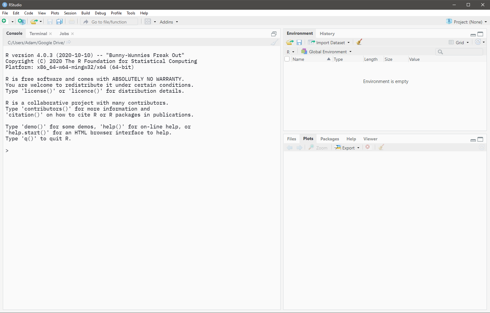

```{r, include=FALSE}
knitr::opts_chunk$set(
  echo=TRUE, message=FALSE, warning=FALSE, fig.align="center", fig.retina=3
)
```

# Lab 1 &mdash; September 15

## Review of R basics

**R** is the name of the programming language. **RStudio** is the name of the integrated development
environment (IDE). The program you should be running is **RStudio**.

If you do not already have these, **R** can be downloaded [here](https://utstat.toronto.edu/cran/). 
**RStudio** (desktop version) can be downloaded 
[here](https://www.rstudio.com/products/rstudio/#rstudio-desktop).


### Configure RStudio settings

The settings can be found under `Tools -> Global Options...`.

```{r, echo=FALSE, out.width="100%"}

```

Uncheck all boxes and modify all dropdowns that mention saving items upon exit and restoring items
upon startup. This will ensure that RStudio starts with a fresh session each time.


### Console pane

When the RStudio application is opened, the **Console** pane should occupy the entirety of the left
side. *(Open the below image in a new tab if it is too small)*

```{r, echo=FALSE, out.width="100%"}

```

Any code that is typed into the **Console** is evaluated immediately upon pressing <kbd>Enter</kbd>.
If you need to evaluate multi-line code, <kbd>Shift</kbd> + <kbd>Enter</kbd> should be used to
create line breaks.


### Source pane


### Variables

Variables are created using the convention `name <- value`. The value of a 

```{r}
v1 <- 3
```


### Vectors

Vectors can be created using the `c()` function with elements separated by commas.

```{r}
nums <- c(9, 12, 20)
words <- c("apple", "orange", "banana")
```


